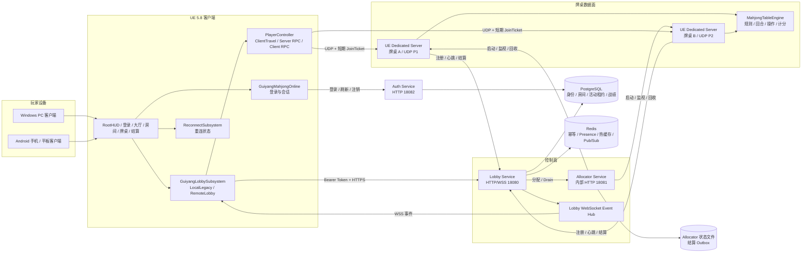
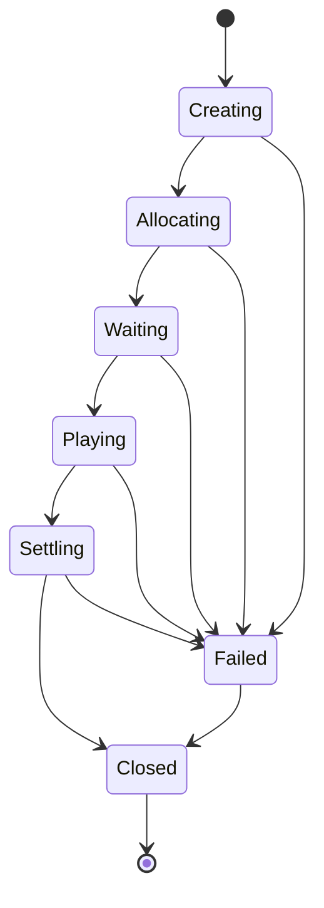
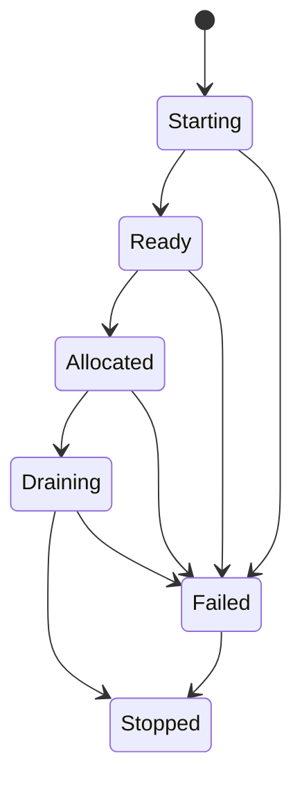
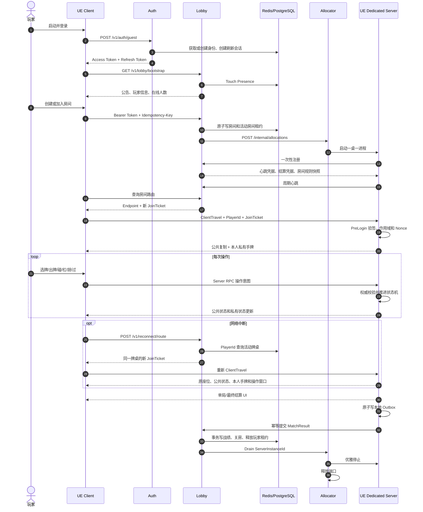
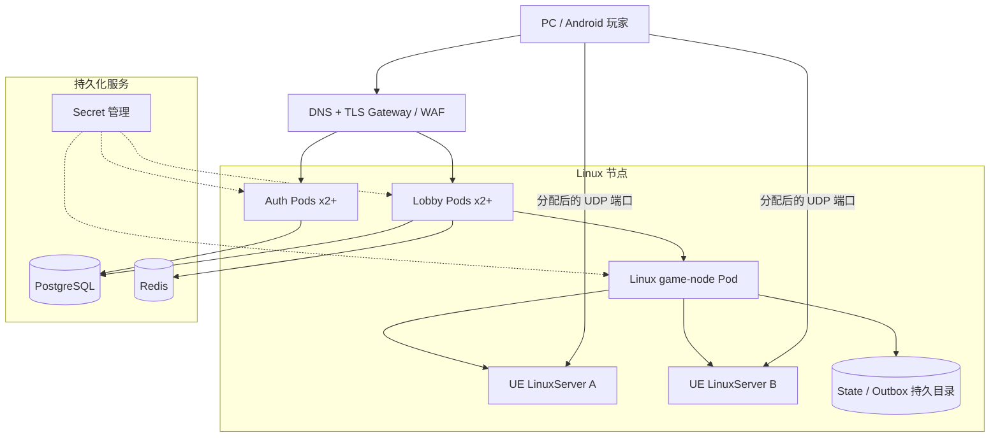

# 《贵阳捉鸡麻将》全套应用架构与详细说明

> 文档版本：1.0  
> 核对日期：2026-07-20  
> 适用范围：Unreal Engine 5.8 PC/Android/平板客户端、Auth、Lobby、Allocator、UE Dedicated Server、PostgreSQL、Redis、CI 与部署清单。

## 1. 文档目的

本文档是当前仓库的系统级说明，面向开发、测试、运维和后续接手人员，回答以下问题：

- 全套应用由哪些进程和基础设施组成；
- 每个组件负责什么、不负责什么；
- 玩家从登录、进入大厅、建房、入桌、对局、重连到结算的完整链路；
- 权威状态、私有数据、密钥和持久化数据分别存放在哪里；
- 本地开发、自动化测试和生产部署分别如何运行；
- 当前哪些能力已经实现并验证，哪些仍属于发布门禁。

本文档以当前代码为准。历史阶段文档仅作为实现过程和测试证据，不应覆盖本文档中的当前边界。

## 2. 总体架构结论

项目采用“身份服务 + 大厅控制面 + 游戏服分配器 + 一桌一 Dedicated Server”的分层架构：

- Auth 是独立应用，负责玩家身份和会话令牌；
- Lobby 是控制面，负责房间目录、玩家到房间的映射、GameServer 路由、重连和最终结算；
- Allocator 是 Linux `game-node` 控制器，负责端口租约和 UE Linux Dedicated Server 进程生命周期；
- UE Dedicated Server 是牌桌数据面，一张牌桌对应一个独立进程；
- UE 客户端只提交操作意图和显示服务端状态，不拥有权威牌局；
- PostgreSQL 保存耐久业务数据；Redis 保存分布式瞬时状态、幂等结果、Presence 和事件；
- OpenAPI 是随各服务发布的契约文件，不是独立应用。

## 3. 应用架构图



## 4. 应用与组件清单

| 组件 | 技术与入口 | 运行平台 | 职责 | 明确不负责 |
|---|---|---|---|---|
| UE Client | `GuiyangMahjong` Game Target | Windows、Android | UI、输入、登录调用、大厅调用、ClientTravel、RPC、重连与结算展示 | 洗牌、手牌生成、操作裁决、权威计分 |
| Auth | `Services/GuiyangMahjong.Auth` | Linux/.NET 10 | 游客身份、访问令牌、刷新轮换、注销、身份存储 readiness | 房间、牌桌、结算 |
| Lobby | `Services/GuiyangMahjong.Lobby` | Linux/.NET 10 | 房间目录、建房/加入、单活动房间租约、GameServer 路由、JoinTicket、重连、结算、事件 | 实时牌局规则、洗牌、手牌 |
| Allocator | `Services/GuiyangMahjong.Allocator` | Linux/.NET 10 | 端口池、GameServer 进程、心跳监视、启动对账、Drain、失败通知、Outbox 恢复 | 玩家 UI、牌局规则 |
| UE Dedicated Server | `GuiyangMahjongServer` Server Target | Linux | 单桌权威房间、规则、动作、超时、复制、重连快照、结算上报 | 多桌调度、全局大厅 |
| PostgreSQL | Compose 使用 PostgreSQL 17 | Linux/托管数据库 | Auth 身份和刷新会话；Lobby 房间、活动租约、战绩 | WebSocket 推送、游戏实时复制 |
| Redis | Compose 使用 Redis 8 | Linux/托管缓存 | Lobby 分布式幂等、Presence、热缓存、事件序号和 Pub/Sub | 最终权威战绩 |
| FakeGameServer | `Services/GuiyangMahjong.FakeGameServer` | .NET 10 | Allocator 自动化测试替身 | 正式游戏运行 |
| EditorTools | `GuiyangMahjongEditorTools` | UE Editor | UI/资产生成、编辑器命令和自动化 | Shipping Runtime |

## 5. UE 工程模块边界

### 5.1 `GuiyangMahjongCore`

这是最底层的纯 Runtime 规则模块，仅依赖 UE 基础模块：

- 麻将牌、手牌、副露、弃牌和动作 DTO；
- 规则配置与不可变规则快照；
- 牌墙与洗牌发牌；
- 回合状态机；
- 出牌、碰、明杠、暗杠、补杠、胡、过；
- 抢杠胡、一炮多响、七对；
- 基础鸡、翻鸡、冲锋鸡、责任鸡、乌骨鸡；
- 超时托管；
- 单局零和计分。

核心入口是 `UMahjongTableEngine`。客户端不能直接修改该对象；它只在权威服务端使用。

### 5.2 `GuiyangMahjongOnline`

独立处理玩家登录：

- `LocalDevelopment`：非 Shipping 本地模拟登录；
- `RemoteAuth`：调用独立 Auth 应用；
- 游客登录、自动登录、访问令牌刷新、注销和过期处理；
- Access Token 与 Refresh Token 只保存在进程内存；
- SaveGame 仅保存非敏感安装标识、玩家显示信息和自动登录偏好。

Shipping 构建不允许使用本地模拟身份代替正式 Auth。

### 5.3 `GuiyangMahjong`

主游戏 Runtime 模块包含：

- `AGuiyangMahjongGameMode`：权威房间、玩家和牌桌流程；
- `AGuiyangMahjongGameState`：公共房间与牌桌复制源；
- `AGuiyangMahjongPlayerController`：输入、Server RPC、私有 Client RPC 和 ClientTravel；
- `AGuiyangMahjongPlayerState`：玩家、房间、座位和准备状态；
- `UGuiyangLobbySubsystem`：LocalLegacy/RemoteLobby 统一入口；
- `UGuiyangReconnectSubsystem`：断线窗口和路由恢复；
- `UGuiyangGameServerBridge`：注册、心跳、结算与 Outbox；
- UMG 页面、三维牌桌、音效、背景音乐和本地战绩。

### 5.4 `GuiyangMahjongEditorTools`

该模块只加载到 Editor Target：

- UI 自动生成 Commandlet；
- UI/资产验证；
- 编辑器自动化测试；
- 资源导入辅助。

Runtime Build.cs 不依赖 `UnrealEd`，因此 Dedicated Server 和 Shipping Client 不携带编辑器依赖。

## 6. 后端服务详细说明

### 6.1 Auth

#### 主要接口

| 方法 | 路径 | 用途 |
|---|---|---|
| POST | `/v1/auth/guest` | 使用安装标识登录游客账号 |
| POST | `/v1/auth/refresh` | 单次轮换 Refresh Token 并签发新会话 |
| POST | `/v1/auth/logout` | 吊销 Refresh Token |
| GET | `/health/live` | 进程存活检查 |
| GET | `/health/ready` | 身份存储依赖检查 |
| GET | `/openapi/v1.yaml` | Auth OpenAPI 契约 |

#### 身份模型

1. 客户端生成 16–128 字符的安装标识；
2. Auth 使用仅服务器持有的 `GuestIdentityPepper` 做 HMAC-SHA256；
3. 安装摘要稳定派生 `PlayerId`；
4. 同一安装标识跨 Auth 副本保持同一玩家身份；
5. Access Token 使用共享 HMAC-SHA256 签名，供 Lobby 验证；
6. Refresh Token 只以 SHA-256 摘要存储；
7. 刷新采用事务性单次轮换，旧令牌不能重放；
8. Logout 将对应刷新会话标记为已吊销。

默认 Access Token 有效期 15 分钟，Refresh Token 有效期 30 天，可通过配置修改。

### 6.2 Lobby

Lobby 是客户端与牌桌数据面的控制面，不参与洗牌和计分。

#### 玩家接口

| 方法 | 路径 | 用途 |
|---|---|---|
| GET | `/v1/lobby/bootstrap` | 公告、玩家信息、在线人数、协议版本 |
| GET | `/v1/rooms` | 公开房间目录 |
| POST | `/v1/rooms` | 创建房间并申请游戏服 |
| POST | `/v1/rooms/{roomCode}/join` | 密码验证并加入房间 |
| GET | `/v1/rooms/{roomCode}/route` | 获取 GameServer 路由和 JoinTicket |
| POST | `/v1/reconnect/route` | 按权威玩家映射重新签发入场票据 |
| GET | `/v1/events` | WebSocket 大厅事件 |

所有 `/v1` 请求要求 Auth 签发的 Bearer Token。除健康检查和 OpenAPI 外，请求还必须携带合法 UUID 格式的 `X-Request-Id`。

创建、加入和重连等操作使用 `Idempotency-Key`。键长度必须为 16–128，RedisPostgres 模式下可跨 Lobby 副本去重。

#### GameServer 内部接口

- 注册 GameServer；
- 上报权威心跳；
- 通知实例失败；
- 提交最终比赛结果；
- 使用内部服务身份恢复 Outbox 结果。

#### 房间状态机



状态更新携带递增 `stateSequence`。PostgreSQL 使用上一序号 CAS，Redis 使用 Lua 比较序号，旧提交不能覆盖新快照。

#### 房间密码

- 密码仅通过 HTTPS 请求体传输；
- 日志不记录明文密码；
- Lobby 保存 PBKDF2-HMAC-SHA256 盐化摘要；
- 比较使用常量时间逻辑；
- 连续失败受到窗口限流。

### 6.3 Allocator

Allocator 是 `game-node` 容器内的 Linux 服务，默认管理 UDP 端口 `19000–19099`。

#### 核心流程

1. Lobby 申请 `RoomId + MatchId + BuildVersion`；
2. Allocator 租用端口；
3. 创建 `ServerInstanceId` 和一次性注册凭据；
4. 在独立进程组中启动 Linux ELF `GuiyangMahjongServer`；
5. 敏感凭据通过环境变量传递，不进入进程命令行；
6. GameServer 注册后实例进入 Ready/Allocated；
7. 监视进程退出、注册超时和心跳超时；
8. 结算或失败后 Drain 进程并归还端口。

#### 实例状态机



#### 持久化和启动对账

Allocator 将以下信息原子写入 JSON 状态文件：

- `ServerInstanceId`、`RoomId`、`MatchId`；
- 端口和 Advertised IP；
- PID 和进程启动时间；
- 实例状态；
- 注册/心跳时间；
- 凭据摘要；
- 待发送失败通知。

启动时根据 PID 与启动时间重新附着仍存活的 GameServer，并重新租用端口。缺失、身份不匹配或已超时的进程会进入 Failed，避免 PID 复用导致附着到无关进程。

#### Readiness

Allocator 只有在以下条件同时成立时返回 ready：

- 启动状态对账已经完成；
- 配置的 GameServer 可执行文件真实存在。

### 6.4 UE Dedicated Server

每张牌桌独占一个进程。GameServer 负责：

- 解析并锁定 Lobby 下发的权威房间和规则快照；
- 在 `PreLogin` 校验 JoinTicket；
- 恢复玩家原座位；
- 洗牌、发牌和回合推进；
- 验证 `RoundId`、`TurnId`、`ClientSequence` 和目标牌；
- 处理碰、杠、胡、过及抢杠窗口；
- 处理回合和响应超时；
- 计算单局与最终结算；
- 通过 GameState/Client RPC 分发公共与私有状态；
- 向 Lobby 注册、心跳和补报结算。

GameServer 不直接访问 PostgreSQL 或 Redis，所有控制面持久化经 Lobby 完成。

## 7. 权威状态和网络安全边界

### 7.1 公共状态

`AGuiyangMahjongGameState` 复制：

- 房间状态和座位；
- 当前局、回合、阶段和操作截止时间；
- 剩余牌数；
- 弃牌；
- 公开副露；
- 其他玩家手牌数量；
- 公开分数和结算信息。

### 7.2 私有状态

仅通过目标玩家 `PlayerController` 的 Reliable Client RPC 发送：

- 本人完整手牌；
- 本人可执行操作；
- 最近接受的客户端序号；
- 私有重连快照。

其他玩家不能通过 GameState 获取本人之外的手牌牌面。

### 7.3 客户端动作

客户端提交的是动作意图：

```text
ActionType + RoundId + TurnId + TargetTileId + ClientSequence
```

服务端拒绝：

- 重复或倒退的序号；
- 过期局号/回合号；
- 当前窗口不允许的动作；
- 不属于该玩家的牌；
- 客户端主动请求服务端专属摸牌；
- 不符合规则检查器的碰、杠或胡。

## 8. 完整运行时序



## 9. 重连和结算恢复

### 9.1 重连

- 客户端不保存或复用旧 JoinTicket；
- 客户端提供的 RoomId/MatchId 只是非敏感提示，不能决定权威路由；
- Lobby 根据已认证 `PlayerId` 查询 `active_player_rooms`；
- 每次重连签发新 JoinTicket；
- GameServer 恢复原座位、公共牌桌、本人手牌、可操作项和剩余时间。

### 9.2 结算幂等

数据库唯一键是：

```text
MatchId + ResultSequence
```

- 相同序号、相同内容：Duplicate，可安全重试；
- 相同序号、不同内容：Conflict，拒绝覆盖；
- 首次合法结果：Accepted，并在同一事务中写战绩和关闭房间。

### 9.3 Outbox

GameServer 在发送网络请求之前，先写入不含凭据的原子 JSON 文件。只有收到 MatchId 和 ResultSequence 完全匹配的成功确认后才删除。

如果 GameServer 崩溃，Allocator 会扫描遗留文件并使用内部服务身份调用 Lobby 恢复接口。GameServer 内存重试和 Allocator 磁盘恢复即使并发，Lobby 数据库唯一约束仍保证至多记分一次。

## 10. 数据存储模型

### 10.1 Auth PostgreSQL

`auth_identities`：

- 安装标识摘要主键；
- 唯一 PlayerId；
- 昵称、Provider、创建和更新时间。

`auth_refresh_sessions`：

- SessionId 主键；
- PlayerId 外键；
- Token 摘要；
- 到期、创建和吊销时间。

### 10.2 Lobby PostgreSQL

`lobby_rooms`：

- RoomId 主键；
- 六位 RoomCode 唯一；
- 生命周期和 StateSequence；
- JSONB 权威房间快照。

`active_player_rooms`：

- PlayerId 主键；
- RoomId、MatchId；
- 强制同一玩家最多拥有一个活动房间。

`match_results`：

- MatchId + ResultSequence 联合主键；
- RoomId、结果 JSONB 和创建时间。

### 10.3 Redis

RedisPostgres 模式保存：

- 房间热快照；
- Idempotency-Key 结果；
- Presence 成员和超时清理；
- 全局事件序号；
- Pub/Sub 大厅事件。

PostgreSQL 仍是房间和比赛结果的最终耐久来源。

### 10.4 Allocator 本地磁盘

- `allocator-state/instances.json`：实例与端口状态；
- `match-result-outbox/*.json`：待恢复的最终结算。

生产环境必须将两者映射到持久卷或稳定主机目录。

### 10.5 客户端本地存储

- 非敏感安装标识和自动登录偏好；
- 音乐、音效、震动设置；
- 最多 50 条本地比赛历史；
- 非敏感重连提示。

Access Token、Refresh Token、JoinTicket 和服务端密钥不得写入 SaveGame。

## 11. UI、三维资产和移动端适配

### 11.1 页面组成

主要 Screen：

- `WBP_RootHUD`
- `WBP_Login`
- `WBP_ConnectServer`
- `WBP_Lobby`
- `WBP_Room`
- `WBP_GameHUD`

主要 Dialog：

- `WBP_CreateRoomDialog`
- `WBP_JoinRoomDialog`
- `WBP_Settings`
- `WBP_Settlement`
- `WBP_ReconnectOverlay`
- `WBP_ConfirmDialog`

主要 Component：

- 手牌、弃牌、操作按钮面板；
- 规则配置和规则摘要；
- 中文错误 Toast。

设置界面包含音乐、音效、震动、音量、重置、关闭和离开游戏。房间和结算页面均提供返回大厅操作。

### 11.2 音频

已接入：

- UI 点击；
- 选牌、出牌；
- 碰、杠、胡、过；
- 背景音乐 `BGM_FirstLightParticles`。

### 11.3 三维麻将牌

- Blender 5.1 程序化生成标准低模；
- 标准源尺寸约 32 × 22 × 44 mm；
- 牌身、牌背、牌面三个材质槽；
- 27 种万/条/筒牌面共用同一个静态网格；
- 运行时按规则牌加载对应牌面纹理；
- 本家手牌正面、其他三家暗牌、四向弃牌、副露和双层牌墙；
- 若静态网格缺失，运行时回退为基础立方体；
- 移动端点击继续使用 UMG 透明交互层，避免逐牌射线检测。

### 11.4 手机和平板

当前 Android 配置：

- 横屏；
- 最低 SDK 26、目标 SDK 34；
- 支持刘海区域和全屏；
- 支持 1.0–3.0 宽高比；
- `ApplicationScale=1.0`；
- 使用自定义最短边 DPI 规则；
- RootHUD 子页面使用 Fill 铺满；
- `DefaultTouchInterface=None`，不显示虚拟摇杆；
- 手机和平板共用响应式页面。

## 12. 安全设计

| 安全对象 | 当前措施 |
|---|---|
| 玩家 Access Token | Auth HMAC-SHA256 签名，Lobby 验证，有效期限制 |
| Refresh Token | 只保存摘要、事务性单次轮换、支持吊销 |
| JoinTicket | 绑定 Player/Room/Match/Instance/Expiry/Nonce，短期且一次性 |
| 房间密码 | PBKDF2-HMAC-SHA256 + 随机盐 + 常量时间比较 |
| Lobby 写操作 | X-Request-Id + Idempotency-Key |
| Allocator 内部 API | 独立 Bearer 服务令牌 |
| GameServer 注册 | 一次性注册凭据，成功后清除 |
| 心跳和结果 | 房间/实例作用域凭据 |
| 敏感值传递 | 环境变量或 Secret 注入，不进入命令行和日志 |
| Outbox | 不保存任何令牌或凭据，限制文件名、目录和大小 |
| 生产 HTTP | 客户端只允许 HTTPS；非 Shipping 仅允许 loopback 明文 HTTP |

生产环境禁止使用 `development-only` 密钥，示例 Secret 不能直接应用。

## 13. 端口和网络边界

| 默认端口 | 组件 | 协议 | 公网暴露建议 |
|---|---|---|---|
| 18082 | Auth | HTTP/HTTPS | 通过 TLS Gateway 暴露 |
| 18080 | Lobby | HTTP/HTTPS + WebSocket/WSS | 通过 TLS Gateway 暴露 |
| 18081 | Allocator | 内部 HTTP | 禁止直接暴露公网 |
| 19000–19099 | UE Dedicated Server | UDP | 仅开放实际分配范围 |
| 5432 | PostgreSQL | TCP | 仅服务网络 |
| 6379 | Redis | TCP | 仅服务网络 |

GameServer 的注册、心跳、失败、结算和 Allocator API 都属于内部控制面流量。

## 14. OpenAPI 契约

OpenAPI 不是独立应用。三个服务分别携带自己的版本化 YAML：

- `Contracts/OpenAPI/auth-v1.openapi.yaml`
- `Contracts/OpenAPI/lobby-v1.openapi.yaml`
- `Contracts/OpenAPI/allocator-v1.openapi.yaml`

每个应用通过 `GET /openapi/v1.yaml` 提供自己的契约。后续可以部署独立 Swagger UI/API Portal 聚合这些文件，但聚合页面不拥有业务逻辑。

## 15. 本地运行模式

### 15.1 当前默认模式

`Config/DefaultGame.ini` 默认是：

```ini
AuthMode=LocalDevelopment
BackendMode=LocalLegacy
```

该模式用于本地 UE 开发和兼容回归，不会自动连接独立 Auth/Lobby。

### 15.2 远程全套模式

UE 命令行覆盖参数：

```text
-MahjongAuthMode=RemoteAuth
-MahjongAuthBaseUrl=http://127.0.0.1:18082
-MahjongLobbyBackend=RemoteLobby
-MahjongLobbyBaseUrl=http://127.0.0.1:18080
```

明文 HTTP 仅允许非 Shipping 的 localhost、127.0.0.1 或 `[::1]`。正式环境必须使用 HTTPS/WSS。

## 16. Linux 一键部署

### 16.1 准备环境文件

通常无需手工创建：首次 `install` 会以 `0600` 权限生成 `Deploy/linux/.env` 和随机密钥。需要预置配置时复制 `Deploy/linux/.env.example`，并替换所有占位值。

必须把所有 `replace-with...` 替换为独立随机值。至少包括：

- PostgreSQL 密码；
- Player Token 签名密钥；
- Guest Identity Pepper；
- JoinTicket 签名密钥；
- Lobby 内部令牌；
- Allocator 服务和回调令牌。

### 16.2 启动

```bash
sudo ./Deploy/linux/deploy.sh install --bootstrap --version <immutable-version>
```

`Deploy/linux/compose.yaml` 一次启动：

- PostgreSQL 17；
- Redis 8；
- Auth，宿主端口 18082；
- Lobby，宿主端口 18080。
- Allocator/game-node，管理端口 18081；
- 每房间一个 FakeGameServer 或真实 UE LinuxServer 子进程，UDP 19000–19099。

### 16.3 部署事务

入口包含主机预检、互斥锁、Docker bootstrap、秘密生成、镜像构建/拉取、升级前备份、真实 readiness、登录/建房/分配/Drain 冒烟和失败自动回滚。`status`、`doctor`、`backup`、`restore`、`upgrade` 与 `rollback` 使用同一个脚本；升级和回滚均不删除数据卷。

## 17. 构建与联调

### 17.1 .NET 服务

```powershell
dotnet restore Services/GuiyangMahjong.Services.slnx
dotnet build Services/GuiyangMahjong.Services.slnx -c Release
dotnet test Services/GuiyangMahjong.Services.slnx -c Release
```

### 17.2 UE Linux Dedicated Server

```powershell
.\Scripts\Build-LinuxServer.ps1 -EngineRoot F:\UnrealEngine-5.8.0-release -Configuration Shipping
```

默认输出：

```text
Artifacts/LinuxServer/
Artifacts/LinuxServer/build-manifest.json
```

构建机需要 UE 5.8 v26 Clang 20.1.8 Linux 交叉工具链。产物必须是 Linux ELF，不依赖 Wine 或 Windows DLL；`GAME_SERVER_VARIANT=unreal` 时被复制到 game-node 镜像。

### 17.3 真实 GameServer 控制面联调

```powershell
powershell -ExecutionPolicy Bypass -File Scripts/Test-Phase4ManagedServer.ps1
```

Linux 部署后的 `Scripts/Linux/smoke-deployment.sh` 验证 Auth、Lobby、Allocator、独立 GameServer、端口分配、注册、路由和 Drain。旧 Windows 脚本只保留兼容回归。

### 17.4 一服四端自动化对局

```powershell
powershell -ExecutionPolicy Bypass -File Scripts/RunFullMatchIntegration.ps1
```

该脚本会启动一个服务端和四个客户端，并使用非 Shipping 集成钩子与超时托管完成一局。它是自动化回归，不等同于四名玩家人工操作验收。

### 17.5 重连自动化

```powershell
powershell -ExecutionPolicy Bypass -File Scripts/RunReconnectIntegration.ps1
```

## 18. Kubernetes 部署架构



部署顺序：

1. `Deploy/kubernetes/namespace-and-config.yaml`；
2. 通过真实密钥系统创建 `mahjong-secrets`；
3. `Deploy/kubernetes/auth-lobby.yaml`；
4. `Deploy/kubernetes/allocator-linux.yaml`。

注意：示例 ConfigMap 引用外部 PostgreSQL 和 Redis 地址，当前 Kubernetes 清单不负责部署数据库和 Redis。

Allocator 使用普通非 root Linux 容器、只读根文件系统、宿主网络和 PVC 启动/管理同 Pod 内的 UE Linux 进程。当前清单采用单副本 `Recreate`，Auth 和 Lobby 可横向扩容；`allocator-windows.yaml` 只保留历史兼容。

## 19. 健康检查和运维

所有服务区分：

- `/health/live`：仅表示进程存活；
- `/health/ready`：检查真实依赖并决定是否接收流量。

具体 readiness：

- Auth：身份存储可用；
- Lobby：PostgreSQL/Redis 可用，并在启用 Allocator 时检查 Allocator；
- Allocator：启动对账完成、GameServer ELF 可执行、工作目录存在、state/outbox 可写，且至少有一个逻辑空闲并可在 OS 层绑定的 UDP 端口。

依赖故障应使 Pod 从 Service 摘除，但不应把健康进程反复重启，因此 readiness 和 liveness 不能互换。

推荐监控指标：

- Auth 登录、刷新、吊销成功率和 401；
- Lobby 建房/加入延迟、幂等命中、Presence 数量、WebSocket 队列溢出；
- Allocator 可用端口、Starting/Failed 实例数、注册与心跳超时；
- GameServer 在线玩家、RoundId、动作超时和结算补报；
- Outbox 文件数量、年龄和恢复失败；
- PostgreSQL 事务冲突、Redis 延迟和连接失败。

## 20. CI

### 20.1 Services CI

`.github/workflows/services-ci.yml` 在 Linux Runner 上执行：

- .NET 10 restore/build；
- 单元和契约测试；
- PostgreSQL 17 与 Redis 7 service container；
- Auth/Lobby 外部持久化测试；
- Allocator 真实子进程恢复测试；
- game-node Linux 镜像构建、非 root 启动与 readiness；
- Compose 与 Bash 脚本静态校验；
- TRX 测试结果上传。

### 20.2 Unreal CI

`.github/workflows/unreal-ci.yml` 需要带 `unreal-5.8` 标签的 Windows Self-hosted Runner：

- Win64 Game 构建；
- Win64 Dedicated Server 构建；
- LinuxServer Build/Cook/Stage 与 manifest/SHA-256 artifact；
- `GuiyangMahjong.*` UE 自动化测试；
- 自动化报告上传。

## 21. 当前验证状态

截至 2026-07-20：

| 项目 | 状态 | 证据/说明 |
|---|---|---|
| Linux .NET 全套测试 | 50/50 通过 | Allocator 11、Auth 5+外部存储 2、Lobby 28+外部存储 4 |
| Linux 一键部署 | 通过 | 重复 install、真实 readiness、建房/分配/Drain 冒烟 |
| 自动回滚 | 通过 | 缺失镜像受控失败后恢复上一版本并重新冒烟 |
| WSL 重启恢复 | 通过 | D 盘 Ubuntu 22.04、systemd、Docker、登录启动任务结果码 0 |
| 一服四客户端自动化完整对局 | 通过 | `Saved/Integration/FullMatch/20260717-160020/result.json` |
| 一服四客户端自动化断线重连 | 通过 | `Saved/Integration/Phase17Reconnect/20260717-100028/result.json` |
| Win64 Game/Server 历史构建 | 通过 | 阶段 6、7 文档与构建产物 |
| 三维麻将资产 | 已生成并导入 | Blender、FBX/GLB/USD、UE StaticMesh |
| UE LinuxServer 首次构建 | 进行中 | v26 Clang 20.1.8 已安装；UAT Build/Cook/Stage 运行中 |
| 四名玩家人工完整对局 | 待验收 | 自动化结果不能替代人工交互 |
| Android 当前安装包 | 仓库内未发现 APK/AAB | 需要重新打包并真机验证 |
| Android 当前连接 | 未发现在线 ADB 设备 | 安装前需重新连接并授权 |
| Kubernetes 生产集群 | 待目标环境验收 | Secret、外部存储、镜像 digest、TLS |

## 22. 发布前必须关闭的门禁

1. 使用真实随机密钥替换全部开发值；
2. 正式域名、TLS/WSS、Android 网络安全与证书验证；
3. 在真实 PostgreSQL/Redis 上执行并发、重启和故障恢复测试；
4. 运行至少两个 Lobby 副本验证幂等、Presence 和跨副本事件；
5. 对 Allocator 在 Starting/Allocated/Draining 状态分别执行强制重启恢复；
6. 标准 Shipping Cook/Stage，不允许使用 `-IgnoreCookErrors`；
7. 四名玩家人工完成创建、加入、准备、整局操作、重连、结算和返回大厅；
8. Android 手机和平板真机验证刘海、全屏、DPI、中文字体、触控、音频和后台切换；
9. Kubernetes Secret 由密钥系统注入，镜像从 `latest` 改为不可变 digest；
10. 确认当前 Phase 8 外部持久化和 CI 变更已提交并在 GitHub Actions 实际通过。

## 23. 关键文件索引

| 内容 | 文件 |
|---|---|
| UE 项目和模块 | `GuiyangMahjong.uproject`、`Source/*/*.Build.cs` |
| 客户端默认模式 | `Config/DefaultGame.ini` |
| Android/UI/输入配置 | `Config/DefaultEngine.ini`、`Config/Android/AndroidEngine.ini`、`Config/DefaultInput.ini` |
| .NET 解决方案 | `Services/GuiyangMahjong.Services.slnx` |
| Auth | `Services/GuiyangMahjong.Auth` |
| Lobby | `Services/GuiyangMahjong.Lobby` |
| Allocator | `Services/GuiyangMahjong.Allocator` |
| OpenAPI | `Contracts/OpenAPI` |
| Linux Compose/一键部署 | `Deploy/linux/compose.yaml`、`Deploy/linux/deploy.sh` |
| Kubernetes | `Deploy/kubernetes` |
| Linux Dedicated Server 构建 | `Scripts/Build-LinuxServer.ps1` |
| Linux 冒烟与诊断 | `Scripts/Linux/smoke-deployment.sh`、`Scripts/Linux/diagnose-network.sh` |
| 四端完整对局 | `Scripts/RunFullMatchIntegration.ps1` |
| 重连集成 | `Scripts/RunReconnectIntegration.ps1` |
| 三维麻将资产 | `Scripts/Blender/GenerateMahjongTileAssets.py`、`SourceArt/3D/MahjongTiles` |
| 历史架构图 | `claudedocs/system_architecture_diagrams.md` |

## 24. 最终说明

当前代码已经形成完整且边界清晰的多人麻将应用：Auth、Lobby、Linux Allocator 和一桌一服数据面均有实际实现，持久化 Linux 全栈已能一键安装、验活、备份和自动回滚。UE 客户端具备登录、大厅、房间、三维牌桌、操作、重连和结算入口。剩余发布门禁是完成真实 UE LinuxServer 镜像切换、多副本/故障环境验收、四人手工完整对局和 Android/平板最终发布验证。
