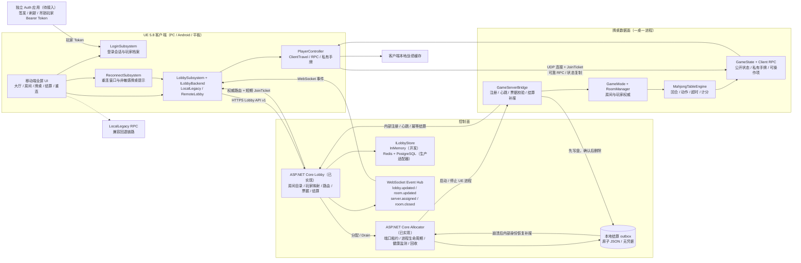
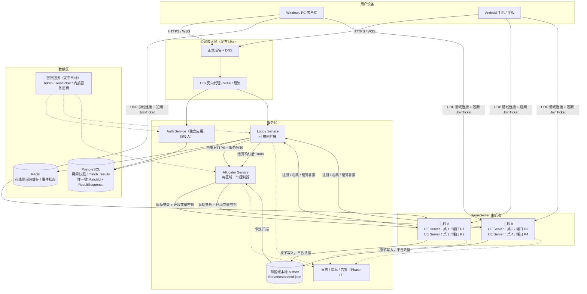
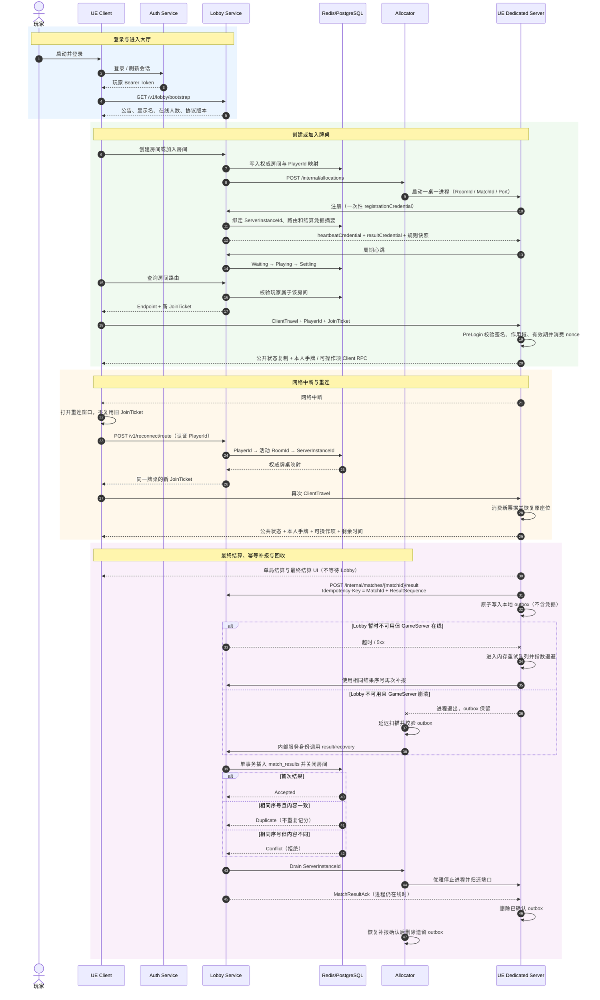
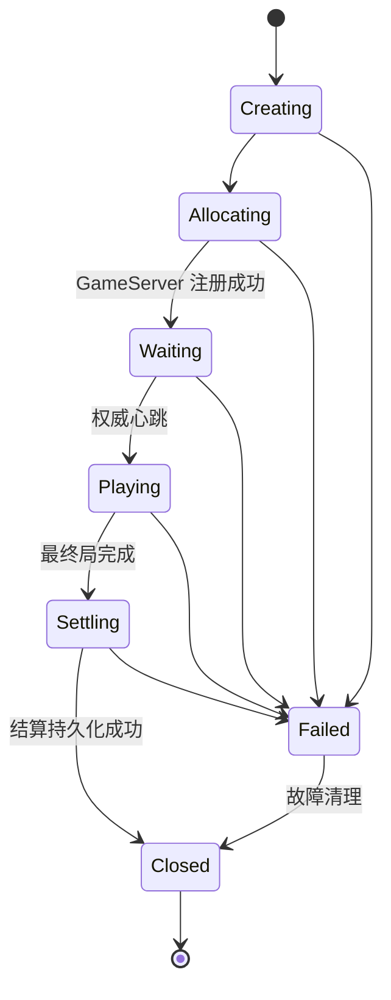

# 《贵阳捉鸡麻将》系统架构图

日期：2026-07-18  
适用范围：UE 5.8 PC/Android/平板客户端、独立 Lobby、Allocator、一桌一进程 Dedicated Server。

> 图中“已实现”表示当前仓库已有对应代码和自动化验证；“待接入/发布目标”表示架构边界已经确定，但仍属于发布门禁。

## 1. 应用架构图

### 核心职责边界

| 组件 | 权威数据 | 明确禁止 |
|---|---|---|
| Auth | 玩家身份、Token 生命周期 | 客户端自签身份；Lobby 暴露公开签发接口 |
| Lobby | 玩家到房间映射、房间生命周期、GameServer 路由、最终战绩 | 承载实时牌局；信任客户端规则或结算 |
| Allocator | 端口租约、GameServer 进程和实例状态 | 承载玩家 UI 或牌局规则 |
| GameServer | 座位、手牌、牌墙、动作、超时、单局和最终结算 | 单进程承载多张牌桌；接受客户端权威状态 |
| UE Client | 输入、展示、本人的临时会话状态 | 保存签名密钥；复用过期 JoinTicket；提交权威结算 |

## 2. 部署架构图

### 部署约束

- 公网只开放 Auth、Lobby 的 HTTPS/WSS 入口和已分配的 GameServer UDP 端口；内部注册、心跳、结算、Allocator API 不直接暴露公网。
- 每张牌桌对应一个 UE Dedicated Server 进程、一个端口和一个 `ServerInstanceId`，进程内不承载第二张桌。
- 开发环境可以使用单机 `Lobby + Allocator + 多个 UE Server`；生产环境使用 Redis/PostgreSQL，并把密钥改为密钥服务注入。
- GameServer 只通过环境变量接收一次性注册凭据和签名材料，敏感值不进入命令行或日志。
- 当前实现要求 Allocator 与其启动的 GameServer 共享本地 outbox 文件系统；扩展到多主机时，应在每台主机部署 Allocator Agent 或使用具备相同原子语义的持久卷。

## 3. 运行流程图

## 4. 关键状态与幂等键

- 建房/加入请求：`PlayerId + Idempotency-Key`。
- 入场票据：绑定 `PlayerId + RoomId + MatchId + ServerInstanceId + ExpiresAt + Nonce`，nonce 只允许消费一次。
- 最终结算：数据库唯一键 `MatchId + ResultSequence`；相同内容安全重试，不同内容拒绝覆盖。
