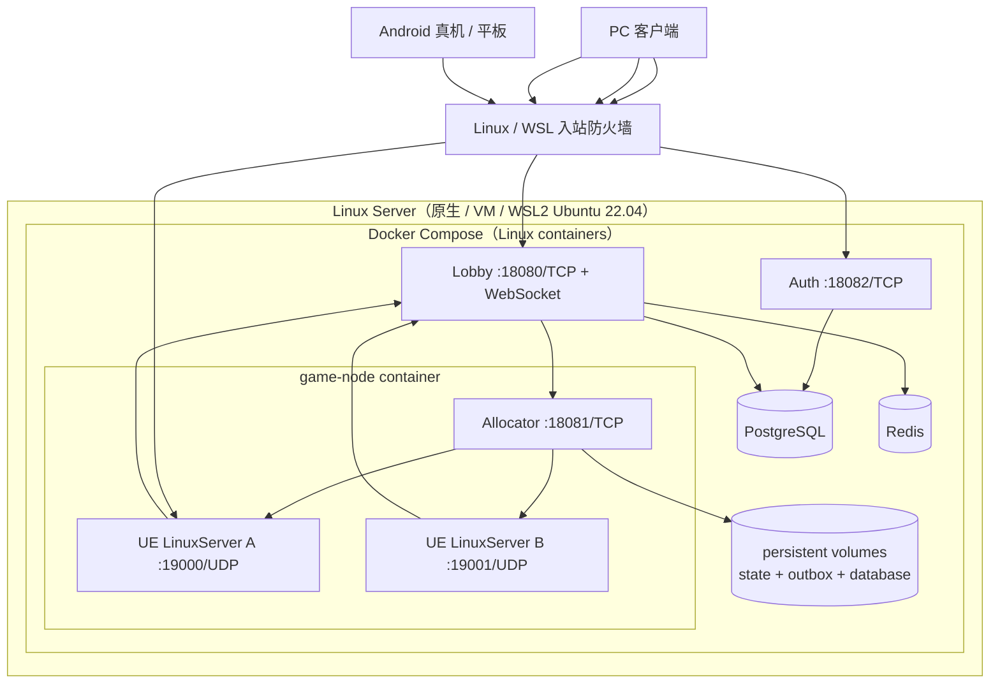
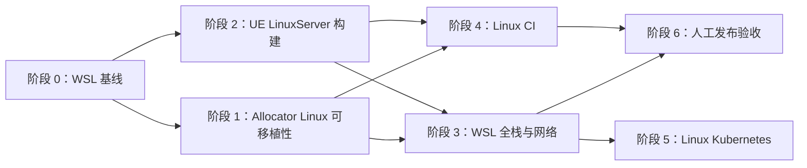

# 贵阳捉鸡麻将 Linux / WSL2 部署审查与执行计划

> 审查日期：2026-07-20  
> 目标：所有服务端应用只部署在 Linux；Windows 仅作为开发、构建和运维入口。WSL2 Ubuntu 使用与原生 Linux 相同的一键部署包。  
> 本文同时记录执行状态。2026-07-21 已完成 WSL/Linux 基线、Allocator Linux 加固、真实 UE LinuxServer 构建与全栈部署、一键部署/回滚、Linux CI 与 Kubernetes Linux 清单；剩余发布门禁为实机四客户端人工完整对局。

## 0. 当前执行状态

| 阶段 | 状态 | 已验证结果 |
|---|---|---|
| WSL2 基线 | 已完成 | `Ubuntu-22.04` 位于 `D:\WSL\Ubuntu-22.04`；systemd、Docker Engine/Compose、镜像网络正常 |
| Linux 服务与 Allocator | 已完成 | 50 项 Linux 测试通过；真实子进程恢复、SIGTERM、外部 PostgreSQL/Redis 均通过 |
| 一键部署 | 已完成 | 重复 install、readiness、建房/分配/释放冒烟通过；受控缺失镜像可自动回滚 |
| WSL 生命周期 | 已完成 | 当前用户登录任务 `GuiyangMahjong-WSL-Server` 已注册并以结果码 0 验证 |
| UE LinuxServer | 已完成 | v26 Clang 20.1.8 完成 Build/Cook/Stage；ELF64 x86-64 与 SHA-256 校验通过，真实进程在 WSL 容器内监听 UDP 19000 并完成 Managed GameServer 注册 |
| 真实 UE 全栈 | 已完成 | `ue-linux-development-20260721` 已部署；Auth、Lobby、Allocator readiness 与真实建房/分配/释放 Smoke 通过；Windows 44/44、Linux 50/50 测试通过 |
| 真机/人工整局 | 待人工验收 | 执行 1 服务端 + 4 人工客户端完整一局，并覆盖 PC/Android 混合、断线重连和返回大厅 |

## 1. 审查结论

当前方案的业务分层是合理的：Auth、Lobby、Allocator、PostgreSQL、Redis 与“一桌一 UE Dedicated Server”职责清晰，Auth/Lobby 已具备 Linux 容器基础，服务端核心代码没有发现阻止 Linux 编译的明显平台绑定。

但当前仓库**尚不能作为 Linux 全套应用部署**。阻塞集中在运行和交付层：

| 等级 | 问题 | 仓库或环境证据 | 影响 |
|---|---|---|---|
| P0 | Ubuntu WSL2 实例损坏 | 注册路径为 `D:\WSL\Ubuntu`，目录不存在；启动返回 `ERROR_PATH_NOT_FOUND` | 无可用 Linux 运行环境 |
| P0 | 缺少 UE 5.8 Linux 工具链和 LinuxServer 产物 | 未配置 `LINUX_MULTIARCH_ROOT`；现有脚本只构建 `Win64/WindowsServer/*.exe` | Allocator 无 Linux UE 进程可启动 |
| P0 | Allocator 交付物仅支持 Windows | 只有 `Services/GuiyangMahjong.Allocator/Dockerfile.windows`；Kubernetes 清单选择 Windows 节点和 HostProcess | 无法在 Linux 节点部署 Allocator |
| P0 | Compose 不是完整运行栈 | `Deploy/docker-compose.yml` 显式设置 `Lobby__Allocator__Enabled=false`，且没有 Allocator 服务 | 建房不能进入真实 GameServer 分配链路 |
| P1 | UE 工程未声明 Linux 目标 | `GuiyangMahjong.uproject` 的 `TargetPlatforms` 只有 Windows、Android | Linux 构建与资产烘焙未进入正式支持范围 |
| P1 | Allocator 进程恢复在 Linux 上可能误认进程 | 可执行路径始终用 `OrdinalIgnoreCase` 比较；读取 `MainModule` 失败后仍允许附着 | 大小写敏感文件系统上存在错误附着和安全风险 |
| P1 | Allocator 停止流程不是真正的 Linux 优雅退出 | 等待宽限期前未发送 SIGTERM，最后直接 `Kill(entireProcessTree: true)` | 对局结算/outbox 落盘可能被强制中断 |
| P1 | WSL 外部 UDP 可达性未定义 | 配置中出现 `AdvertisedIp=0.0.0.0`；没有 WSL 镜像网络、Hyper-V 防火墙及 Android 入站验证 | 客户端得到不可连接地址或 UDP 被拦截 |
| P1 | 部署路径仍是 Windows 路径 | ConfigMap 使用 `C:/mahjong/...` 和 `.exe` | Linux 文件、权限和持久化均失败 |
| P1 | UE CI 仅覆盖 Win64 | `.github/workflows/unreal-ci.yml` 只构建 Win64 Game/Server | Linux 回归无法阻止错误合入 |
| P0 | 缺少一键部署入口 | 没有统一的 Linux compose、部署编排、预检、迁移、验活和失败回滚脚本 | 无法可靠重复部署完整服务端 |
| P2 | Linux 运维生命周期未定义 | 无 WSL 启动任务、备份/恢复和升级/回滚编排 | Windows 重启或 WSL 回收后服务不会自动恢复 |
| P2 | Linux readiness 仍可加强 | Auth/Lobby 已检查依赖；Allocator 只检查状态对账和文件存在，未检查可执行权限、端口池与写目录 | 探针可能在实际不可启动 GameServer 时误报就绪 |

### 可直接保留的部分

- Auth、Lobby 的 Linux 多阶段 Dockerfile。
- PostgreSQL/Redis 数据模型和外部持久化测试。
- Lobby 的真实依赖 readiness：持久化层和 Allocator 都参与判断。
- Allocator 的状态文件、启动对账、端口池与 match-result outbox 设计。
- `GuiyangMahjongServer.Target.cs` 以及 UE Dedicated Server 权威模型。
- Allocator 真实子进程测试已经区分 `.exe` 与 Linux 无扩展名可执行文件，可扩展为 Linux CI 门禁。

## 2. 推荐目标拓扑

统一采用“全 Linux 容器化服务端”。Windows 上不运行任何服务端进程；WSL2 只是本地 Linux 主机，原生 Linux 服务器使用同一个 Compose 文件和同一个部署入口：



选择这一拓扑的原因：

1. PostgreSQL、Redis、Auth、Lobby、Allocator 都由 Compose 统一编排，安装、启动、升级、验活和回滚只有一个入口。
2. `game-node` Linux 镜像同时包含 Allocator 和已 Stage 的 UE LinuxServer；Allocator 只在容器内启动 Linux ELF 子进程，不控制宿主机进程。
3. `game-node` 显式发布 `18081/TCP` 和 `19000-19099/UDP`。Lobby 通过 Compose 服务名 `game-node:8080` 调用 Allocator，外部客户端使用 Linux 主机的 advertised IP/DNS。
4. Allocator 为容器主进程并由 `tini`/等价 init 转发信号和回收僵尸进程；状态与 outbox 使用持久卷。容器重建会结束该节点上的 UE 子进程，启动对账必须将遗留实例置为失败并安全补报 outbox。
5. 该部署包既能在 WSL2 验收，也能在原生 Ubuntu 22.04/受支持 Linux 主机运行；不维护一套 WSL 专用业务拓扑。

WSL 应作为本地开发、集成和验收环境。若需要公网生产级持续运行，最终仍应部署到原生 Linux VM、裸机或 Kubernetes 节点；WSL 发行版本身仍可能被 Windows 关闭，Compose 的 restart policy 不能替代宿主机可用性保障。

## 3. 固定技术决策

| 项目 | 决策 |
|---|---|
| WSL 发行版 | Ubuntu 22.04 LTS，WSL2；放在 D 盘独立目录 |
| WSL 网络 | Windows 11 支持时使用 `networkingMode=mirrored`；启用 `dnsTunneling` 与防火墙 |
| Linux 数据与运行路径 | `/srv/guiyang-mahjong` 放发布产物；`/var/lib/guiyang-mahjong` 放状态/outbox；不把运行数据放在 `/mnt/c`、`/mnt/h` |
| 容器引擎 | 原生 Linux 使用 Docker Engine + Compose plugin；WSL 可使用 Docker Desktop Linux Engine integration，禁止同时运行第二套 daemon |
| UE Linux 构建 | Windows 上安装 UE 5.8 对应 v26 Linux cross-compile toolchain，生成 LinuxServer ELF；WSL 只负责运行与验收 |
| Allocator 首发形态 | `game-node` Linux 容器的主服务，启动同一容器内的 UE LinuxServer ELF 子进程 |
| 服务发现 | 容器内部只使用 Compose DNS：Lobby → `http://game-node:8080`；禁止 `host.docker.internal` 成为生产依赖 |
| 客户端路由 | Lobby 返回宿主机 LAN 可达 IP 或正式 DNS；禁止返回 `0.0.0.0`、容器 IP 或仅 WSL 内部可见 IP |
| GameServer 端口 | 首批固定 `19000-19099/UDP`；一实例一端口，入站规则与容量一致 |
| 密钥 | root-only 环境文件、Compose secrets 或密钥管理器注入；不得写入镜像、Git、命令输出或 UE 日志 |
| 交付策略 | 一个版本化 Linux 离线/在线部署包、一个 Compose project、一个 `deploy.sh`；后续 Kubernetes 复用相同镜像 |

### 3.1 一键部署合同

最终交付包必须让管理员在全新受支持 Linux 主机上只执行一个入口命令：

```bash
sudo ./Deploy/linux/deploy.sh install --bootstrap --version <immutable-version>
```

WSL2 从 Windows 调用相同入口，不允许维护第二套部署逻辑：

```powershell
wsl -d Ubuntu-22.04 -- bash -lc "cd ~/src/MahjongGame && sudo ./Deploy/linux/deploy.sh install --bootstrap --version <immutable-version>"
```

`deploy.sh` 必须是幂等、失败即非零退出并支持无人值守，内部按以下事务执行：

1. 取得主机级部署锁，防止两个部署并发执行。
2. 预检 Linux 发行版、x86_64、内核/glibc、CPU、内存、磁盘、端口、Docker/Compose 和 UDP 防火墙前置条件。
3. 首次安装可通过显式 `--bootstrap` 安装受支持的 Docker Engine；默认不得静默修改系统软件源。
4. 创建专用目录和 root-only secrets 文件；缺少必须秘密时安全生成或直接失败，不使用弱默认值。
5. 拉取或从离线包载入以版本/SHA 固定的镜像，验证 checksum；禁止仅以 `latest` 部署。
6. 对 PostgreSQL 和 Allocator state/outbox 生成部署前备份。
7. 运行独立、可重复执行的数据库 migration job；迁移成功后才替换应用容器。
8. 执行 `docker compose up -d --remove-orphans`，按 PostgreSQL → Redis → Auth → game-node → Lobby 的依赖顺序等待真实 readiness。
9. 执行脱敏冒烟：登录、Lobby bootstrap、创建测试房、Allocator 启动一个 UE LinuxServer、注册/心跳、释放测试房。
10. 成功后写入部署 manifest；失败则保存诊断包并自动恢复上一镜像版本。若数据库迁移不可逆，必须在部署前拒绝自动升级。

同一入口还必须支持：

```text
deploy.sh install|upgrade|rollback|status|doctor|backup|restore
```

`uninstall` 必须是单独的显式破坏性命令，并要求二次确认；任何部署/升级命令都不得删除数据库、Redis、Allocator state 或 outbox 卷。

## 4. 分阶段执行计划

### 阶段 0：恢复可用的 WSL2 基线

目标：建立可重复、可启动、位于 D 盘的 Ubuntu 22.04 环境。

任务：

1. 确认损坏的 `D:\WSL\Ubuntu` 没有需要恢复的 VHDX；如无数据价值，注销损坏实例。
2. 下载/安装 Ubuntu 22.04，并使用 `wsl --import` 将实例放到 `D:\WSL\Ubuntu-22.04`。
3. 在 `%UserProfile%\.wslconfig` 设置镜像网络、DNS tunneling、防火墙以及合理的内存/CPU 上限。
4. 在 `/etc/wsl.conf` 启用 systemd；重启 WSL 后验证 PID 1 为 systemd。
5. 启用 Docker Desktop 对该发行版的 WSL integration，只保留一个 Docker daemon。
6. 将仓库通过 Git 克隆到 `~/src/MahjongGame`。Windows 的 `H:\MahjongGame` 继续作为现有工作区，但不得让两个目录各自形成未同步的修改源。
7. 创建 `/srv/guiyang-mahjong`、`/var/lib/guiyang-mahjong/{allocator-state,match-result-outbox}` 和 `/var/log/guiyang-mahjong`，配置专用低权限账户。
8. 增加 Windows 启动任务，只负责唤醒 WSL/Docker Linux Engine 并调用部署包的幂等 `status/start` 路径；业务服务生命周期由 Compose 管理。

验收门禁：

- `wsl -d Ubuntu-22.04 -- uname -a`、`systemctl is-system-running` 可执行。
- `docker context` 指向 Linux engine，`docker run --rm hello-world` 成功。
- WSL 内文件创建、Unix 权限、大小写敏感与重启持久化验证通过。
- Windows 重启后，启动任务能够唤醒 WSL/Docker，Compose 的 restart policy 可恢复整套服务。

回滚：保留新发行版的 `wsl --export` 基线备份；不覆盖任何可恢复的旧 VHDX。

### 阶段 1：建立 Linux 服务与 Allocator 可移植性门禁

目标：先用 FakeGameServer 在 Linux 上闭环 Auth → Lobby → Allocator → 子进程。

代码任务：

1. 新增 `Services/GuiyangMahjong.Allocator/Dockerfile`，作为 Linux `game-node` 镜像基线；最终镜像包含 Allocator、`tini` 和版本匹配的 UE LinuxServer staged artifact，保留 `Dockerfile.windows` 仅作历史兼容。
2. 为 `AllocatorOptions` 增加 `GameServerWorkingDirectory`，并在启动前验证：路径绝对化、文件存在、Linux execute bit、状态/outbox 目录可写、端口池合法。
3. 修正 `GameServerProcessLauncher`：
   - Windows 使用大小写不敏感路径比较，Linux 使用 `Ordinal` 和规范化真实路径。
   - Linux 重附着必须验证 `/proc/<pid>/exe`、启动时间及实例身份；无法读取时 fail closed。
   - 为每个实例建立独立进程组；停止时先发 SIGTERM，等待宽限期，再 SIGKILL。
   - 防止 PID 重用导致附着到无关进程。
4. 状态文件原子替换后补充 Linux 目录 `fsync` 策略，确保掉电恢复语义；outbox 文件名比较改为平台正确语义。
5. Allocator readiness 增加可执行权限、工作目录、状态/outbox 可写、至少一个可租用且 OS 未占用端口的检查。
6. 新增 Bash 版 Linux 集成脚本，禁止依赖 PowerShell-only 的路径和 `.exe`。
7. 扩展 `ProcessRecoveryIntegrationTests`，覆盖 SIGTERM、强杀、PID 重用、大小写不同文件、状态恢复与端口冲突。

部署任务：

1. 新增平台统一的 `Deploy/linux/compose.yaml`：包含 PostgreSQL、Redis、Auth、Lobby 和 `game-node`，开启真实持久化并发布固定 UDP 范围。
2. 为所有容器设置非 root 用户、只读根文件系统（需要写入的目录单独挂卷）、资源限制、日志轮转、健康检查和 `restart: unless-stopped`。
3. Lobby 的 Allocator 地址固定使用 Compose DNS `http://game-node:8080`；`game-node` 的 advertised address 由部署脚本根据显式域名/LAN IP注入。
4. 提供 `Deploy/linux/.env.example` 与 secrets 模板，只包含键名和非敏感默认值。
5. 新增 `Deploy/linux/deploy.sh` 骨架，首批实现 `install/status/doctor`，且在 FakeGameServer 模式下完成一键闭环。

验收门禁：

- 在 WSL 中执行 .NET Release build/test，全部现有单元、契约、外部存储及真实进程恢复测试通过。
- Compose 中 PostgreSQL、Redis、Auth、Lobby、Allocator 全部健康，Windows 进程列表中没有任何服务端进程。
- 创建房间后 FakeGameServer 启动、注册、心跳、回收；重启 Allocator 后实例对账正确。
- 日志与持久化文件不包含 Token、注册凭据或签名密钥。
- 在干净 WSL 发行版内执行一次 `deploy.sh install` 即完成部署，重复执行不会破坏数据或重复初始化。

### 阶段 2：产出 UE 5.8 Linux Dedicated Server

目标：生成可在 Ubuntu 22.04 WSL2 运行的真实 `GuiyangMahjongServer` ELF 产物。

任务：

1. 在 Windows 安装 UE 5.8 对应的 v26 cross-compile toolchain（Clang 20.1.8），设置并验证 `LINUX_MULTIARCH_ROOT`。
2. 将 `Linux` 加入 `GuiyangMahjong.uproject` 的 `TargetPlatforms`；审查插件和 Runtime 模块在 Server/Linux 目标上的可用性。
3. 新增 `Scripts/Build-LinuxServer.ps1`：调用 UBT/UAT 完成 Linux Server Build、Cook、Stage、Pak/Archive，并输出固定目录与 manifest。
4. 将现有 `Build-Phase4Server.ps1`、`Test-Phase4ManagedServer.ps1` 中的 Windows 假设抽成平台参数，或保留旧脚本并新增等价 Linux 脚本；不得让 Linux 路径再寻找 `.exe`。
5. 在 WSL 中用 `file`、`readelf`、`ldd` 检查 ELF 架构、动态依赖和 glibc 基线；确保脚本有 execute bit。
6. 将 staged LinuxServer 作为受版本控制的 CI artifact 输入 `game-node` 镜像构建；镜像构建不得依赖开发机上的隐式目录。
7. 在 `game-node` 容器内运行 `-NullRHI -Unattended` 单实例冒烟，验证 UDP 监听、Lobby 注册、心跳、票据验证、信号转发和优雅退出。

验收门禁：

- LinuxServer 构建、Cook、Stage 无错误，产物 manifest 和版本号可追踪到 Git commit。
- `GuiyangMahjongServer` 在 Linux 容器中不依赖 Windows DLL/Wine，使用普通 Linux 用户启动。
- Auth/Lobby/Allocator readiness 全绿；真实 UE Server 注册后 Allocator 才报告实例 Ready。
- SIGTERM 能完成心跳停止、结算/outbox 落盘和进程退出；超时才允许 SIGKILL。

### 阶段 3：完成 WSL 全栈部署与网络闭环

目标：Windows PC、Android 手机和平板均能进入 WSL 内的真实 Linux GameServer。

任务：

1. 配置 WSL mirrored networking；记录不支持该模式时的 NAT 回退方案，但 UDP 验收优先要求镜像网络。
2. 为 TCP `18080/18082`、内部 TCP `18081` 和 UDP `19000-19099` 建立最小 Windows/Hyper-V 防火墙规则；Allocator 内部端口仅允许本机/受信网段。
3. 增加启动时 advertised endpoint 解析：显式配置 LAN IP/DNS，并拒绝 unspecified、loopback（外部模式）和容器内部地址。
4. Android 客户端配置指向 Windows 宿主 LAN 地址或正式域名，不写死 WSL 动态地址。
5. 增加 `Scripts/Linux/diagnose-network.sh` 和 Windows 侧诊断脚本，输出监听端口、路由、防火墙、TCP/UDP 探测结果，不输出秘密。
6. Compose 增加所有服务的 healthcheck、依赖条件、资源限制和统一日志轮转；只由 Compose 控制应用启动顺序和恢复策略。
7. 记录 WSL/Windows/Docker Desktop 重启矩阵，验证数据库、Redis、Allocator 状态和未完成 outbox 恢复。
8. 完成 `deploy.sh upgrade/rollback/backup/restore`，并让一键部署在任何一步失败时自动输出诊断和恢复上一应用版本。

验收门禁：

- Windows PC 能登录大厅并加入 Linux Server。
- Android 手机和平板在同一 LAN 上能登录、建房、收取 WebSocket 事件并连接 UDP GameServer。
- Lobby 返回的 IP/端口从每类客户端均可达，且永不返回 `0.0.0.0`。
- Windows、WSL、Docker Desktop 分别重启后都有明确恢复结果，无幽灵房间、重复结算或端口泄漏。
- 在空白 Linux/WSL 主机上执行一个 install 命令即可完成全栈部署和冒烟；部署过程中不要求管理员手工进入容器执行命令。

### 阶段 4：Linux CI 与可复现发布

目标：每次合入都验证 Linux 服务端，发布产物可重建、可回滚。

任务：

1. 保留现有 `services-ci.yml` 的 Ubuntu 测试，并增加 `game-node` Linux 镜像构建、非 root 运行、容器健康和真实子进程测试。
2. 在 `unreal-ci.yml` 增加 LinuxServer job：首选 Windows 自托管 runner + 官方 v26 交叉工具链；缓存只缓存工具链和安全的 Derived Data。
3. 上传 LinuxServer tarball、完整服务镜像清单、部署包、manifest、SBOM、SHA-256 和自动化报告；镜像标签使用不可变 Git SHA，禁止部署仅有 `latest` 的版本。
4. 增加 Compose 配置校验、Kubernetes schema 校验、shell lint 和密钥扫描。
5. 建立发布目录的 `current`/`previous` 原子切换与一键回滚；数据库迁移必须向前兼容上一版服务。

验收门禁：

- PR 同时通过 .NET Linux、Allocator process recovery、UE LinuxServer build/automation。
- 从全新 WSL 或 Ubuntu 22.04 基线仅凭一个部署包和一个 install 命令可部署成功。
- 回滚到 previous 版本不丢失 Allocator state/outbox，Lobby 不产生重复结算。

### 阶段 5：Linux Kubernetes 清单（WSL 基线稳定后）

目标：让同一 Linux 产物可迁移到原生 Linux Kubernetes，而不依赖 Windows HostProcess。

任务：

1. 新增 `Deploy/kubernetes/allocator-linux.yaml`，保留 `allocator-windows.yaml` 作为历史兼容项。
2. 把 ConfigMap 路径改为 Linux 路径；移除 Windows securityContext，加入专用 UID/GID、只读根文件系统和最小 capabilities。
3. 采用“一节点一个 Allocator + 多 UE 子进程”的节点级设计时，使用 Linux node affinity、固定 UDP 端口池、持久卷和明确的 pod disruption 策略。
4. 若改为“一房间一 Pod”，必须先重构 Allocator 为 Kubernetes API 调度器；不能在未改模型时简单套 Deployment。
5. 替换 `latest` 镜像，增加 NetworkPolicy、Pod Security、PVC/备份、资源/容量和滚动升级策略。

验收门禁：

- Linux 清单通过 schema/policy 检查，且不含 `C:\`、`.exe`、Windows nodeSelector 或 HostProcess。
- 节点重启和 pod 重建后状态对账正确，正在进行的对局处理策略有明确结果。
- 客户端 UDP 路由、端口容量和外部负载均衡方式经过实机验证。

### 阶段 6：最终发布验收

必须人工完成以下场景，不能只用自动模拟代替：

1. 1 个 Auth、1 个 Lobby、1 个 Allocator、1 个真实 UE Linux Dedicated Server、4 个独立客户端完整一局。
2. PC 与 Android 混合入桌；创建、加入、准备、摸牌、出牌、碰、杠、胡、结算、返回大厅均正常。
3. 对局中执行一次客户端断网重连；执行一次 Lobby 重启；另开测试桌验证 GameServer 异常退出与房间失败处理。
4. 重复结算请求只能入账一次；Allocator 重启后能恢复状态和 outbox；端口最终归还。
5. 手机刘海、不同宽高比和平板 UI 不因服务端迁移发生回归。
6. 保存服务端、客户端、Allocator、Auth/Lobby、PostgreSQL/Redis 的脱敏日志和验收记录。

完成标准：所有自动门禁和人工场景均通过，且在 WSL 重启、Windows 重启、服务升级/回滚后能够恢复到文档定义的状态。

## 5. 文件级变更清单

| 文件/目录 | 计划动作 |
|---|---|
| `GuiyangMahjong.uproject` | 增加 Linux 目标平台 |
| `Services/GuiyangMahjong.Allocator/Options/AllocatorOptions.cs` | 增加工作目录和 Linux 启动校验配置 |
| `Services/GuiyangMahjong.Allocator/Services/GameServerProcessLauncher.cs` | 平台正确路径比较、身份校验、进程组和 SIGTERM 流程 |
| `Services/GuiyangMahjong.Allocator/Services/AllocatorStateStore.cs` | 加强 Linux rename 后目录持久化 |
| `Services/GuiyangMahjong.Allocator/Services/MatchResultOutboxRecovery.cs` | 修正大小写敏感语义 |
| `Services/GuiyangMahjong.Allocator/Api/AllocatorEndpoints.cs` | 加强 readiness |
| `Services/GuiyangMahjong.Allocator.Tests/*` | 增加 Linux 进程、信号、PID/路径与恢复测试 |
| `Services/GuiyangMahjong.Allocator/Dockerfile` | 新增 Linux 镜像 |
| `Deploy/linux/compose.yaml` | PostgreSQL、Redis、Auth、Lobby、game-node 的统一 Linux 编排 |
| `Deploy/linux/.env.example` | 非敏感环境变量模板 |
| `Deploy/linux/deploy.sh` | install/upgrade/rollback/status/doctor/backup/restore 唯一部署入口 |
| `Deploy/linux/migrations/*` | 独立且可重复执行的数据库迁移任务 |
| `Deploy/linux/firewall/*` | TCP/UDP 最小开放规则及 WSL/原生 Linux 适配 |
| `Deploy/kubernetes/namespace-and-config.yaml` | 拆分平台无关和平台特定配置 |
| `Deploy/kubernetes/allocator-linux.yaml` | 新增 Linux 节点清单 |
| `Scripts/Build-LinuxServer.ps1` | UE 5.8 LinuxServer 交叉构建 |
| `Scripts/Linux/*` | 冒烟、网络诊断及部署内部辅助脚本；管理员只调用 `deploy.sh` |
| `.github/workflows/services-ci.yml` | Linux Allocator 镜像与进程恢复门禁 |
| `.github/workflows/unreal-ci.yml` | LinuxServer 构建、自动化与发布产物 |
| `Deploy/README.md` | WSL2、Linux、网络、密钥、升级与回滚操作手册 |

## 6. 执行依赖与建议顺序



允许并行：阶段 1 和阶段 2 在 WSL 基线完成后可以并行；CI 可在各自第一份稳定产物出现后增量接入。阶段 3 必须等待真实 Linux Allocator 和真实 UE LinuxServer 同时可用。

## 7. 风险与控制

| 风险 | 控制措施 | 回滚/降级 |
|---|---|---|
| 删除损坏 WSL 实例导致数据丢失 | 注销前检查目录、备份与注册表信息，明确旧 VHDX 不可恢复 | 保留 export/VHDX 备份，导入新名称 |
| WSL mirrored networking 在当前 Windows 构建不可用 | 阶段 0 先验证；防火墙与 LAN UDP 纳入硬门禁 | PC 本机可 NAT 调试；Android 发布验收不得以 TCP-only 代理替代 UDP |
| UE 插件或第三方库不支持 Linux | 按 Runtime/Server 模块逐项编译和 `ldd` 审查 | 禁用非服务端插件；保留 WindowsServer 产物作为短期回退 |
| Linux 信号导致结算中断 | SIGTERM 宽限期、outbox 先落盘、幂等回报 | SIGKILL 后由 Allocator 启动对账补报 |
| WSL 与 Windows 双工作区代码漂移 | Git 为唯一传递机制；只允许一个工作区持有未提交改动 | 丢弃可重建副本，按 commit 重新克隆 |
| Windows/WSL/Docker 多层网络地址混淆 | 明确 bind、internal URL、advertised endpoint 三类配置 | 启动时拒绝非法 advertised IP，回退到已验证的 LAN 地址 |
| WSL 被关闭导致整套容器停止 | Windows 启动任务唤醒 WSL/Docker，Compose restart policy 恢复；健康监测识别发行版离线 | 手工启动 WSL 后调用 `deploy.sh status`；生产迁移原生 Linux |
| 一键部署在数据库迁移后失败 | 迁移前备份、只允许向前兼容迁移、应用 readiness 通过后才提交部署 manifest | 自动回滚上一镜像；不可逆迁移在预检阶段拒绝执行 |
| game-node 容器重建导致进行中牌桌中断 | 节点标记 draining 后升级、outbox 先落盘、启动对账、升级窗口内拒绝新房间 | 等待活跃牌桌清零；紧急故障时明确将受影响房间标记失败 |

## 8. 官方基线资料

- [Unreal Engine 5.8 Linux Development Requirements](https://dev.epicgames.com/documentation/unreal-engine/linux-development-requirements-for-unreal-engine?lang=en-US)
- [Unreal Engine Linux Development Quickstart](https://dev.epicgames.com/documentation/unreal-engine/linux-development-quickstart-for-unreal-engine)
- [Unreal Engine Dedicated Servers](https://dev.epicgames.com/documentation/unreal-engine/setting-up-dedicated-servers-in-unreal-engine?lang=en-US)
- [Microsoft WSL networking](https://learn.microsoft.com/en-us/windows/wsl/networking)
- [Microsoft WSL systemd](https://learn.microsoft.com/en-us/windows/wsl/systemd)
- [Microsoft WSL file systems](https://learn.microsoft.com/en-us/windows/wsl/filesystems)
- [Microsoft WSL install](https://learn.microsoft.com/en-us/windows/wsl/install)

## 9. 第一执行批次

下一阶段建议只执行以下可独立验收的批次：

1. 恢复 Ubuntu 22.04 WSL2 到 D 盘，启用 systemd 与 mirrored networking。
2. 在 WSL Linux 文件系统内建立部署目录、专用用户和 Docker Linux Engine integration。
3. 修复 Allocator 的 Linux 路径、进程身份、SIGTERM 和 readiness，并用 FakeGameServer 完成 Linux 容器测试。
4. 生成统一 `Deploy/linux/compose.yaml`、`game-node` 镜像和 `deploy.sh install/status/doctor`，完成所有服务端应用的一键部署闭环。

上述批次通过后再安装 UE v26 toolchain 并进入真实 LinuxServer 构建，可将环境问题与 UE 编译问题分开定位。
