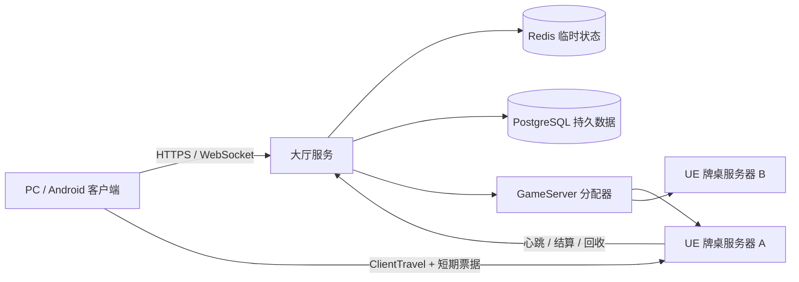

# 贵阳捉鸡麻将：大厅服务与牌桌服务器分离执行计划

## 1. 目标与结论

采用“大厅/分配控制面 + 一桌一 UE Dedicated Server 数据面”的架构：

- 大厅服务负责登录接入、公告、在线状态、房间目录、入场控制、GameServer 分配和路由。
- UE Dedicated Server 负责单张牌桌的权威规则、洗牌、发牌、操作裁决、超时、结算和局内重连快照。
- 当前阶段允许大厅服务、分配器和 UE Server 部署在同一台机器，但代码、协议和数据归属必须独立。
- 不允许单个 `GameState` 同时向多张牌桌复制不同状态。
- 第一阶段保留现有 `UGuiyangRoomManager`；创建房间时立即分配 GameServer，降低迁移风险。

## 2. 范围与非目标

### 本计划范围

- 大厅服务 API 与 WebSocket 事件。
- GameServer 注册、心跳、分配、回收和故障标记。
- 房间号到服务器端点的路由。
- 短期签名入场票据和服务端校验。
- UE 客户端大厅接入、`ClientTravel` 和重连路由。
- 结算回报、幂等、监控、部署与端到端验证。

### 当前非目标

- 不立即把等待房间和准备状态从 `UGuiyangRoomManager` 迁移到大厅服务。
- 不立即实现跨地域调度、Kubernetes 或自动扩缩容。
- 不让大厅服务参与洗牌、手牌、出牌和计分。
- 不把核心架构绑定到仍处于 Beta 状态的 UE Online Services Lobbies。

## 3. 目标拓扑



## 4. 数据归属

| 数据 | 权威拥有者 | 持久化 | 禁止事项 |
|---|---|---|---|
| 账号、登录会话、封禁状态 | Auth/大厅服务 | PostgreSQL/安全缓存 | UE 客户端不得生成正式身份 |
| 公告、在线人数、服务器状态 | 大厅服务 | Redis + 可选数据库 | 不进入单桌 `GameState` |
| 房间号、服务器端点、生命周期 | 大厅服务/分配器 | Redis，关键事件落库 | 客户端不得指定服务器实例 |
| 房间号、房间属性、初始规则定义 | 大厅服务 | Redis/数据库 | UE 不得重生成房号，客户端不得改写规则 |
| 规范化规则快照、座位、准备状态 | UE GameServer | 进程内存，必要时快照 | 只能从大厅初始定义生成；开局后不得修改 |
| 密码入场 | 生产目标由大厅 HTTPS 校验 | 仅保存盐化摘要 | 密码、盐、摘要不得进入日志和票据 |
| 牌墙、手牌、回合、操作窗口 | UE GameServer | 进程内存/局内快照 | 不进入大厅、客户端公共状态 |
| 最终结算与战绩 | UE 产生，大厅幂等接收 | PostgreSQL | 客户端结算不得作为权威来源 |

## 5. 分阶段执行

### 阶段 0：基线冻结与回退门禁

任务：

1. 归档当前一服四客户端完整对局、断线重连、Android 连接和 UI 测试结果。
2. 增加运行模式设计：`LocalLegacy` 与 `RemoteLobby`。
3. 定义关联字段：`RequestId`、`PlayerId`、`RoomId`、`ServerInstanceId`、`MatchId`。
4. 明确任何新链路失败时可切回 `LocalLegacy`，不得删除现有 RPC 链路。

验收：

- 旧模式编译、自动化测试和一服四客户端仍通过。
- 回退不依赖数据库迁移回滚。

### 阶段 1：协议与客户端抽象

任务：

1. 定义 OpenAPI 规范与统一错误码。
2. 在 UE 新增 `UGuiyangLobbySubsystem` 和 `ILobbyBackend` 抽象。
3. 定义 DTO：大厅启动信息、创建房间、加入房间、房间路由、服务器状态、入场票据、结算回报。
4. 提供 `LocalLegacyLobbyBackend`，内部调用现有链路，保证 UI 可先迁移到统一接口。
5. 所有异步请求增加超时、取消、重试上限和主线程回调。

建议首批接口：

- `GET /v1/lobby/bootstrap`
- `POST /v1/rooms`
- `POST /v1/rooms/{roomCode}/join`
- `GET /v1/rooms/{roomCode}/route`
- `POST /v1/reconnect/route`
- `POST /internal/gameservers/register`
- `POST /internal/gameservers/heartbeat`
- `POST /internal/matches/{matchId}/result`

验收：

- OpenAPI 校验通过。
- UI 不再直接依赖具体大厅实现。
- LocalLegacy 行为与当前版本一致。

### 阶段 2：大厅服务 MVP

默认技术建议：ASP.NET Core Web API + WebSocket + Redis + PostgreSQL；若团队采用 Go，只要保持 OpenAPI 与事件协议不变即可替换。

任务：

1. 实现大厅启动信息、公告、在线状态、房间目录和房间号唯一性。
2. 实现游客/正式 Token 验证适配层，不接受客户端自签身份。
3. 实现密码房 HTTPS 入场校验、限流和审计脱敏。
4. 实现房间状态机：`Creating -> Allocating -> Waiting -> Playing -> Settling -> Closed/Failed`。
5. WebSocket 事件至少包含：`lobby.updated`、`room.updated`、`server.assigned`、`room.closed`。

验收：

- 并发创建房间不会产生重复房间号。
- 密码错误限流、日志脱敏和 Token 过期测试通过。
- 大厅服务重启后可从 Redis/数据库恢复房间路由。

### 阶段 3：GameServer 分配器

任务：

1. 实现端口池、进程启动、健康检查、心跳超时和回收。
2. 服务器启动参数包含：`RoomId`、`ServerInstanceId`、`Port`、`LobbyInternalUrl`、一次性注册凭据。
3. GameServer 注册后才能进入 `Ready`；未注册实例不得向玩家发放路由。
4. 实例状态机：`Starting -> Ready -> Allocated -> Draining -> Stopped/Failed`。
5. 第一阶段采用“创建房间立即分配”，后续再增加预热池和准备后分配。

验收：

- 同机至少启动两张牌桌，端口与状态完全隔离。
- 杀死实例后大厅在心跳窗口内标记失败并拒绝新玩家进入。
- 空房和结算完成实例能自动退出并归还端口。

### 阶段 4：UE GameServer 接入

任务：

1. `GuiyangMahjongServer` 启动时读取分配参数并向大厅注册。
2. 在 `PreLogin/Login` 前验证短期入场票据；票据绑定 `PlayerId`、`RoomId`、`ServerInstanceId`、过期时间和随机数。
3. 将大厅签名的规则快照传入现有 `UGuiyangRoomManager`，客户端参数只作为请求，不作为权威值。
4. 保留现有单桌 `GameState`、私有手牌 Client RPC、操作序列和重连快照。
5. GameServer 定期发送心跳：人数、房间阶段、回合、构建版本和可接入状态。

验收：

- 错房间、错服务器、过期和重复票据均被拒绝。
- 两张牌桌的公开状态、私有手牌、日志和结算无交叉。
- 一服四客户端完整对局继续通过。

### 阶段 5：UE 客户端与 UI 迁移

任务：

1. 登录后由 `UGuiyangLobbySubsystem` 获取大厅启动信息。
2. `WBP_Lobby` 的创建/加入改为调用 Lobby Backend，不再假定固定服务器地址。
3. 收到路由和票据后，通过 `ClientTravel` 连接目标 GameServer。
4. `WBP_Room` 和 `WBP_GameHUD` 继续消费 GameServer 权威复制状态。
5. “返回大厅”断开 GameServer，但保留大厅 HTTP/WebSocket 会话。
6. PC、Android、平板统一使用同一协议，UI 保持现有全屏适配。

验收：

- 创建、加入、返回大厅、房间关闭、服务器不可用均有明确中文状态。
- 客户端不能通过修改 IP、端口或房间号绕过票据校验。
- Android 真机可从大厅进入牌桌并返回。

### 阶段 6：重连与结算闭环

任务：

1. 重连先向大厅查询 `PlayerId -> RoomId -> ServerInstanceId`，再签发新票据。
2. GameServer 继续提供公共状态、本人手牌、可操作项和剩余时间快照。
3. 结算回报使用 `MatchId + ResultSequence` 幂等键。
4. 大厅确认结算后再写战绩、关闭房间并通知分配器回收。
5. GameServer 回报失败时进入重试队列，禁止重复记分。

验收：

- 断线后更换网络仍可恢复原座位和本人手牌。
- 重复结算请求只入账一次。
- 大厅短暂不可用不会使已运行牌局停止；恢复后可补报结果。

### 阶段 7：可观测性、安全与部署

任务：

1. 公网 API 全部 TLS；内部注册使用双向 TLS 或短期服务凭据。
2. 日志统一携带 `RequestId/RoomId/ServerInstanceId/MatchId`，禁止记录密码和完整 Token。
3. 指标覆盖：在线数、房间数、分配延迟、启动失败率、心跳丢失、重连成功率、对局完成率。
4. 设置资源限制、空闲超时、最大牌局时长和优雅退出窗口。
5. 大厅与分配器先同机独立进程部署，稳定后再拆主机或容器。

验收：

- 可以从单个 `RoomId` 串联大厅、分配器和 GameServer 全链路日志。
- GameServer 崩溃不会拖垮大厅或其他牌桌。
- 密钥轮换不要求重新发布客户端。

### 阶段 8：端到端发布门禁

必须通过：

1. 一个大厅服务、一个分配器、至少两个 GameServer、八个独立客户端并行运行。
2. 两张牌桌同时完成一局，状态和私有数据完全隔离。
3. 密码错误、满房、重复加入、票据过期、非法服务器、服务端崩溃、重连和重复结算覆盖。
4. PC 与 Android 交叉进入同一牌桌。
5. 关闭 `RemoteLobby` 后，LocalLegacy 回归仍通过。
6. 构建 Editor、Game、Server 和 Android；保存服务端、客户端、API、分配器日志及结果 JSON。

## 6. 依赖关系与执行顺序

```text
阶段 0
  -> 阶段 1
      -> 阶段 2
          -> 阶段 3
              -> 阶段 4
                  -> 阶段 5
                      -> 阶段 6
阶段 2 + 阶段 3 + 阶段 4 -> 阶段 7
全部阶段 -> 阶段 8
```

可并行工作：

- 阶段 2 大厅服务与阶段 1 的 UE LocalLegacy 适配器可在协议冻结后并行。
- 阶段 3 分配器与阶段 4 的 GameServer 注册客户端可在内部 API 冻结后并行。
- UI 视觉调整可与服务端实现并行，但不得提前删除旧 RPC 路径。

## 7. 风险与回滚

| 风险 | 控制措施 | 回滚 |
|---|---|---|
| 大厅和 GameServer 状态不一致 | 明确单一权威、状态序号、幂等请求 | 切回 LocalLegacy |
| GameServer 启动过慢 | 创建即分配，后续增加预热池 | 暂时固定常驻实例 |
| 票据泄露或重放 | 短过期、随机数、房间/实例绑定、一次性消费 | 吊销签名密钥版本 |
| 结算重复入账 | MatchId + ResultSequence 唯一约束 | 关闭异步补报，人工审计 |
| UE Online Services 接口变化 | 自有 `ILobbyBackend`，平台 SDK 仅作适配器 | 切换自有 REST/WebSocket |
| Android 网络切换 | 大厅重签票据 + 现有重连快照 | 返回大厅并保留战绩 |

## 8. 完成定义

只有同时满足以下条件，才允许宣布架构迁移完成：

- 大厅和牌桌服务器职责、协议和数据归属已分离。
- 生产链路不依赖客户端提供的身份、规则或结算。
- 多桌并行、重连、故障和幂等测试全部通过。
- PC/Android 可以创建、加入、完整对局、结算和返回大厅。
- 可观测性能够定位到单个玩家、房间、服务器实例和牌局。
- LocalLegacy 在至少一个稳定版本周期内保留并可一键回退。

## 9. 建议立即开始的第一个里程碑

1. 冻结 `Lobby API v1` DTO、错误码和状态机。
2. 创建 `UGuiyangLobbySubsystem`、`ILobbyBackend` 和 `LocalLegacyLobbyBackend`。
3. 将 `WBP_Lobby` 的创建/加入入口改接统一接口，但默认仍走 LocalLegacy。
4. 为两种模式增加自动化契约测试。
5. 在上述门禁通过后，再创建真正的大厅服务和分配器工程。

## 10. 实施状态（2026-07-18）

第一执行切片已落地，范围为阶段 0 与阶段 1 的低风险迁移边界：

| 项目 | 状态 | 证据 |
|---|---|---|
| `LocalLegacy` / `RemoteLobby` 配置 | 已实现 | `Config/DefaultGame.ini`，支持 `-MahjongLobbyBackend=` 命令行覆盖 |
| Lobby API v1 DTO、错误码、状态机 | 已冻结 | `Source/GuiyangMahjong/Public/Lobby/GuiyangLobbyTypes.h` |
| `ILobbyBackend` 抽象 | 已实现 | `Source/GuiyangMahjong/Public/Lobby/GuiyangLobbyBackend.h` |
| `UGuiyangLobbySubsystem` | 已实现 | 统一生成 `RequestId`、提交事件与失败事件 |
| `LocalLegacyLobbyBackend` | 已实现 | 保留原有 `PlayerController` 可靠 RPC，不删除旧链路 |
| 创建、加入、快速开始 UI 接线 | 已实现 | UI 不再直接调用具体大厅后端 |
| OpenAPI v1 | 已实现 | `Contracts/OpenAPI/lobby-v1.openapi.yaml` |
| 模式与 DTO 契约测试 | 已实现 | `GuiyangMahjong.Lobby.*Contract` |

安全门禁：当前 `RemoteLobby` 只冻结协议，不包含网络实现。若误启用会返回
`BackendNotConfigured` 和明确中文提示，不会静默回退或连接未知地址。阶段 2 必须在本切片编译、
自动化测试通过后启动。

### 2026-07-18 验证记录

- `GuiyangMahjongEditor Win64 Development`：UHT、C++ 编译与模块链接成功。
- `GuiyangMahjong.Lobby.BackendModeContract`：成功。
- `GuiyangMahjong.Lobby.DtoContract`：成功。
- 自动化 JSON：`succeeded=2`、`failed=0`。
- OpenAPI YAML：解析成功，8 个必需端点、16 个唯一错误码。
- `GuiyangMahjongServer` 的 `GuiyangMahjong` 模块变体：8/8 编译动作成功。
- 运行时回退验证：独立服务器日志确认 `BackendMode=LocalLegacy`，`GameNetDriver` 监听 `17779`。

边界说明：本次未执行源引擎首次完整 Server 单体链接；该操作还需约 950 个引擎编译动作，留到
阶段 4 的正式 Dedicated Server 发布门禁。本次已经验证项目运行时模块在 Server 配置下可编译，
并由 Editor Server 实际启动验证本地兼容后端。

## 11. 阶段 2 实施状态（2026-07-18）

独立 ASP.NET Core 大厅服务 MVP 已实现于 `Services/GuiyangMahjong.Lobby`：

| 项目 | 状态 | 验证 |
|---|---|---|
| 大厅启动信息、公告、在线状态 | 已实现 | 真实 HTTP `bootstrap` 冒烟通过 |
| 公开房间目录 | 已实现 | 创建后目录返回对应房间 |
| 六位房间号原子唯一性 | 已实现 | 领域 200 路、HTTP 50 路并发测试无重复 |
| 玩家 Token 适配 | 已实现 | 有效、过期、篡改测试通过；无公开签发端点 |
| 密码房保护 | 已实现 | PBKDF2-SHA256、固定时间比较、5 次限流、响应脱敏测试通过 |
| 房间状态机 | 已实现 | 非法跨阶段转换测试通过 |
| WebSocket 事件 | 已实现 | `lobby.updated`、`room.updated` 实际收发通过；四类事件协议已冻结 |
| Redis + PostgreSQL 适配器 | 已实现并编译 | PostgreSQL 唯一约束、Redis 热缓存、数据库回源逻辑 |
| OpenAPI 独立输出 | 已实现 | `/openapi/v1.yaml`，YAML 解析通过 |

验证结果：Release 构建 0 警告、0 错误；自动化测试 `13/13` 通过；独立进程在
`127.0.0.1:18080` 完成健康检查、鉴权、建房与目录查询。

剩余外部门禁：当前机器未安装 Docker、Redis 或 PostgreSQL，因此尚未执行真实外部存储的进程
重启恢复测试。该门禁不能用内存测试替代；配置 `RedisPostgres` 模式并完成真实恢复验证后，才允许
将阶段 2 标记为生产验收通过。阶段 3 可以继续开发，但不得以此绕过生产发布门禁。

## 12. 阶段 4 第一执行切片（2026-07-18）

本切片把分配器的 Fake GameServer 启动契约替换为真实 UE Dedicated Server 可消费的托管契约：

- `GuiyangMahjongServer` 读取房间、牌局、实例、端口、Lobby 地址、构建版本和一次性注册凭据。
- 长期 JoinTicket HMAC 密钥只通过 `MAHJONG_JOIN_TICKET_SIGNING_KEY` 进程环境变量注入。
- UE Server 完成 Lobby 注册、周期心跳，并在注册成功前保持登录关闭。
- `PreLogin` 验证票据签名、玩家、房间、牌局、实例、有效期和 nonce；nonce 只允许消费一次。
- `InitNewPlayer` 把已验证 PlayerId 绑定到 PlayerController，后续会话 RPC 不得切换身份。
- 客户端提供 `ConnectToAllocatedServer`，使用 URL 编码后的 PlayerId 与 JoinTicket 执行 `ClientTravel`；
  Server 两个消费点显式 URL 解码。
- 托管配置无效或桥接初始化失败时保持失败关闭；未带托管标志的 `LocalLegacy` 行为不变。

本切片不把阶段 4 标记为全部验收完成。后续切片仍需把大厅签名的权威规则快照和 RoomCode
引导进 `UGuiyangRoomManager`，并执行两桌隔离与一服四客户端完整对局门禁。

## 13. 阶段 4 第二执行切片（2026-07-18）

本切片完成了 Lobby 到 UE 单桌实例的权威房间引导：

- `GameServerRegistrationAck` 新增 `roomBootstrap`，包含 RoomId、固定六位 RoomCode、MatchId、房主、局数、四人容量、公开/自动开始/密码属性和规则对象。
- Lobby 在建房时深拷贝规则字典，校验规则对象大小与 `ruleId`，注册时只下发持久化权威副本。
- UE 严格解析已知规则字段并生成可校验的 `FGuiyangRuleSnapshot`；范围、类型、房号或容量错误时保持失败关闭。
- `UGuiyangRoomManager` 支持创建固定房号的托管房间和票据认证后的玩家入座；最后玩家离开时保留托管房间，不破坏 Lobby 路由。
- 每个 UE 进程只允许初始化一个托管房间；本地创建、快速开始和按房号加入接口在托管模式下关闭。
- 只有 GameMode 完成权威房间初始化后 Bridge 才标记注册成功并启动心跳。

验收结果：Lobby 17/17、Allocator 4/4、UE `GameServer.*` 4/4；WindowsServer Build/Cook/Stage 成功。真实两进程联调确认两桌拥有不同 RoomCode、MatchId 和 RuleHash，2/2 实例均在注册后心跳，崩溃实例进入 Failed，后续房间成功回收原端口。

阶段 4 仍保留一项人工发布门禁：四个真实客户端从 Lobby 获取路由和票据，进入同一托管桌完成整局、重连与结算。架构隔离边界保持“一桌一 Dedicated Server 进程”，不实施单进程多桌。

## 14. 阶段 5 第一执行切片（2026-07-18）

UE 客户端远程大厅传输层和 UI 接线已实现：Lobby 启动信息、公开房间快速匹配、创建、加入、
异步路由轮询、短期票据 `ClientTravel` 和返回大厅均经过统一 `UGuiyangLobbySubsystem`。
生产配置仍保持 `LocalLegacy`，因为玩家 Token 必须由后续独立 Auth 应用签发，签名密钥不会进入客户端。

验证结果：UE Server 构建成功，Lobby 契约自动化 3/3、Lobby 服务 17/17、Allocator 4/4、
多进程控制面回归 `INTEGRATION_OK`。详细边界、配置和未关闭门禁见
`claudedocs/phase5_remote_lobby_status.md`。Phase 6 才开始实现重新查询玩家所在牌桌并重签票据，
不得把本切片的返回大厅逻辑误标记为断线重连完成。

## 15. 阶段 6 自动化执行闭环（2026-07-18）

重连与最终结算核心控制面已接通。RemoteLobby 重连以认证 PlayerId 的 Lobby 权威映射为准，
客户端只保存非敏感房间提示并在每次重连时获取新 JoinTicket。GameServer 使用房间作用域结算凭据，
通过非阻塞指数退避队列提交最终结果；提交前先把不含任何凭据的结果原子写入本地 outbox。
Lobby 使用 `MatchId + ResultSequence` 原子去重，写入战绩、关闭房间后通知 Allocator 回收进程。
若 Lobby 中断期间 GameServer 同时崩溃，Allocator 使用内部服务身份扫描并恢复补报遗留 outbox。

验证结果：Lobby 22/22、Allocator 6/6、UE Lobby 3/3、UE GameServer 4/4；真实 UE
Dedicated Server 多进程控制面及 Lobby 进程中断后的 outbox 恢复均为 `INTEGRATION_OK`。
详细实现、故障边界和剩余外部/人工门禁见
`claudedocs/phase6_reconnect_settlement_status.md`。
